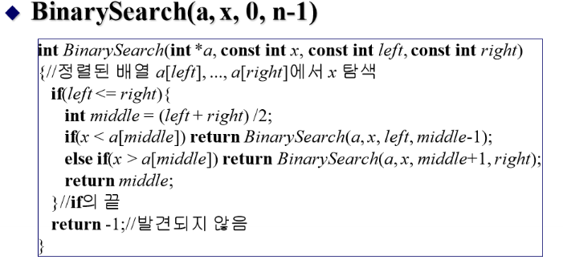
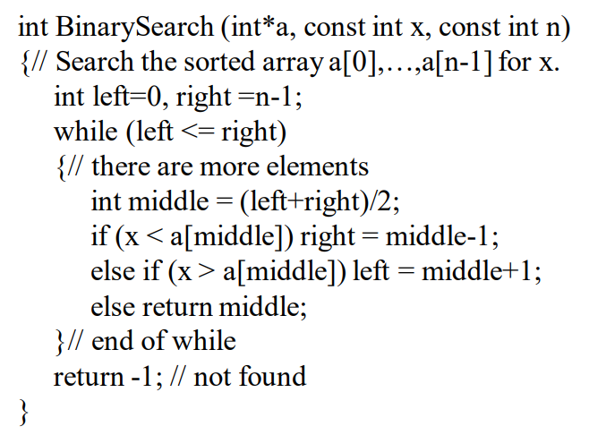

> Database Management Systems 3ed, Ramakrishan and J.Gehrke

# Chapter 1: Intro

## DB설계 단계

### level 1 - Human
: 인간이 이해하기 쉬운 구조로 설계
- E/R(Entity/Relationship) model  

이런 식으로 관계도를 만들어 모델화(도형화) 하는 것이 첫 번째 단계이다.

### level 2 - DBMS
: 데이터베이스에 저장하기 위해 위 모델을 테이블구조로 변환해야한다.

### level 3 - Computer
: 디스크에 저장

___
이렇게 데이터를 저장하기 위해 세 번의 설계가 필요하다.(단계 생략 불가)

## Levels of Abstraction

**View(External Schema):** 사용자가 개인의 입장에서 필요한 데이터베이스의 논리적 구조를 정의 **(사람을 위한 것)**

**Conceptual Schema:** 데이터베이스의 전체적인 논리적인 구조를 **(DBMS를 위한 것)**

**Physical Schema:** 데이터베이스의 물리적인 저장 방식을 결정 **(컴퓨터를 위한 것)**

## DBMS의 장점

### 1. 데이터 중복성 제거
- 데이터 관련 대부분의 문제의 근원인 데이터 중복성을 제거함
- 데이터 중복성을 제거하기 위해 '정규화' 기법 사용
- 데이터 중복성 제거 -> 데이터 무결성 보증 -> 데이터 신뢰성 보증

### 2. 데이터 독립성
: 데이터베이스의 구조와 데이터의 내용이 서로 영향을 미치지 않는 것을 의미한다.
- 데이터베이스의 논리적 구조(Conceptual Schema)가 변경되어도 프로그램에 영향을 주지 않음
- 데이터베이스의 물리적 구조(Physical Scheam)가 변경되어도 논리적 구조나 데이터에 영향을 주지 않음 
- DBMS와 달리, OS는 논리적 구조가 바꾸면 프로그램 코드가 바뀜 **(데이터 종속성)**

### 3. 동시성 지원
: 수많은 프로그램들이 동시에 데이터베이스에 접근하는 것을 가능하게 함