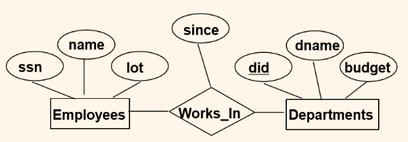
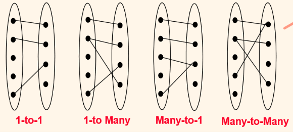
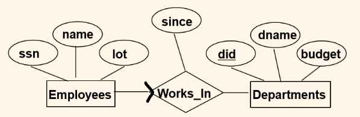

>학습 교재: Database Management Systems 3ed, Ramakrishan and J.Gehrke

# ER model: Entity - Relationship Model

## ER Model Basics

**Entity**
- Real-World object = 실세계에 존재하는 개체
- Attribute(속성)을 가지고 있음

**Entity Set**
- Entity들의 집합
- 한 Entity Set에서 각각의 Entity들은 공통되는 속성 종류를 가지고 있음. 하지만 그 값은 다름  
- ER model 에서 직사각형으로 표시

**Attribute**
- Entity가 가지고 있는 속성을 의미
- 키(key)속성: 중복불가한, 다른 Entity와 구별 가능한 속성  ex) 주민등록번호, 학번 
- ER model 에서 타원형으로 표시

Entity Set: Students  
Attributes: 학번, 이름, 나이  
Key Attributes: 학번(각각의 고유 학번 존재(중복 불가))  

**Relationship**
- Entities 간의 관계를 의미
- Entity와 마찬가지로 속성을 가질 수 있음

**Relationship Set**
- Relationship들이 집합
- Entity Set 간의 관계를 의미
- ER model 에서 마름모로 표시

Entity Set: Employees, Departments  
Relationship Set: Wroks_In  
**직원**이 **부서**에서 **일 하는** 관계를 나타낸다.

## Key Constraints

**관계**
- 일대 일 관계
- 일대 다 관계
- 다대 일 관계
- 다대 다 관계

각 타원: Entity Set  
점: Entity  
하나의 줄: Relationship  
전체 줄: Relationship Set  

이전 사진에서 직원이 부서에 일 하는 관계를 파악했다. 그런데 한 직원이 여러 부서에서 일하는 건지, 아니면 여러 직원이 한 부서에서 일하는 건지 어떻게 구분할까? 바로 **화살표**를 이용하면 된다.
- 화살표X: Entity Set과 Relationship Set이 일대 다 관계
- 화살표O: Entity Set과 Relationship Set이 일대 일 관계

Employees --> Works_In 이므로 1 : 1 관계  
Departments -- Works_In 이므로 1 : N 관계  
**Employees** 1:1 **Works_In** N:1 **Departments** 이렇게 된다.  
따라서 Entity Set끼리의 관계는 **Employees** N : 1 **Departments**  이렇게 된다.  
해석: 한 직원 한 부서에만 일할 수 있고, 한 부서에는 여러직원이 일할 수 있다.

## Participation Constraints

